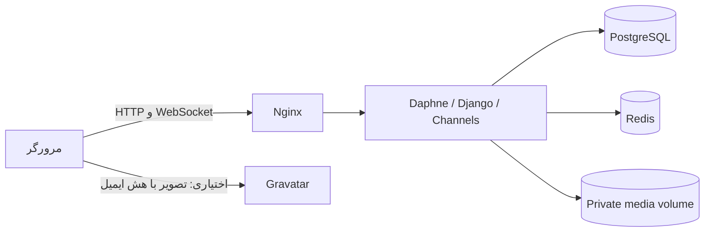

# راهنمای استفاده، توسعه و معماری Pulse

این سند برای کاربر، توسعه‌دهنده و مدیر سرور نوشته شده است. Pulse یک پیام‌رسان خصوصی دونفره است که روی سرور خودتان اجرا می‌شود. عبارت «خصوصی» یعنی دسترسی کاربران به گفتگو محدود است؛ پیام‌ها رمزنگاری سرتاسری ندارند و مدیر مجاز سرور می‌تواند به محتوای ذخیره‌شده دسترسی داشته باشد.

## ۱. استفاده از برنامه

### ساخت حساب و ورود

از صفحه Create account نام کاربری و رمز عبور را وارد کنید. ایمیل اختیاری است و برای تصویر Gravatar استفاده می‌شود. ایمیل به کاربران دیگر نمایش داده نمی‌شود. برای ورود، نام کاربری و رمز همان حساب لازم است. خروج با دکمه خروج و درخواست POST انجام می‌شود.

### شروع گفتگو

در New chat نام کاربری دقیق طرف مقابل را جستجو کنید. جستجو به بزرگی و کوچکی حروف حساس نیست. روی Message بزنید. اگر گفتگو از قبل وجود داشته باشد همان گفتگو باز می‌شود. گفتگو با خودتان مجاز نیست. در فهرست گفتگوها، آخرین پیام و تعداد پیام‌های خوانده‌نشده دیده می‌شوند.

### پیام، تاریخ و وضعیت خواندن

Enter پیام را می‌فرستد؛ Shift+Enter خط جدید می‌سازد. متن تا ۴۰۰۰ کاراکتر پذیرفته می‌شود. یک تیک یعنی پیام ذخیره شده و دو تیک یعنی گیرنده خواندن آن را تأیید کرده است. تأیید خواندن زمانی ارسال می‌شود که صفحه گفتگو فعال باشد و کاربر در انتهای تاریخچه قرار داشته باشد.

پیام‌ها بر اساس روز با Today، Yesterday یا تاریخ کامل گروه‌بندی می‌شوند. تاریخ و ساعت در منطقه زمانی مرورگر بیننده نمایش داده می‌شوند؛ نگه‌داشتن نشانگر روی ساعت، زمان کامل را نشان می‌دهد. Load earlier messages پیام‌های قبلی را در صفحه‌های ۵۰تایی می‌گیرد.

### فایل، عکس و وویس

دکمه کنار کادر پیام برای انتخاب فایل است. هر فایل باید غیرخالی و حداکثر ۵ MiB، یعنی ۵٬۲۴۲٬۸۸۰ بایت باشد. متن هم‌زمان با فایل به‌عنوان کپشن ذخیره می‌شود. PNG، JPEG، WebP و GIF معتبر به‌صورت عکس نمایش داده می‌شوند؛ فایل‌های عمومی دانلود می‌شوند.

برای وویس روی میکروفن بزنید و مجوز مرورگر را بدهید. با زدن دوباره، ضبط متوقف می‌شود. قبل از ارسال می‌توانید صدا را گوش کنید یا Remove بزنید. ضبط در پنج دقیقه یا نزدیک سقف حجم متوقف می‌شود. روی دامنه واقعی HTTPS لازم است؛ localhost برای توسعه استثناست. پشتیبانی کدک‌ها به مرورگر بستگی دارد.

قطع موقت WebSocket باعث حذف پیام ذخیره‌شده نمی‌شود. صفحه دوباره وصل می‌شود و پیام‌های جاافتاده را از تاریخچه دریافت می‌کند. درخواست ارسال HTTP یک UUID جداگانه دارد تا تلاش مجدد همان پیام را تکراری نسازد. هنگام خطای ارسال، متن و فایل انتخابی برای تلاش مجدد باقی می‌مانند.

### پروفایل خودتان

روی عکس یا نام خود در پایین فهرست گفتگوها بزنید و Edit profile را باز کنید. می‌توانید نام، نام خانوادگی، ایمیل، شماره تلفن و عکس را تغییر دهید. نام کاربری در این فرم قابل تغییر نیست.

شماره با کد کشور مانند `+989121234567` وارد می‌شود. فاصله و جداکننده‌ها حذف و ارقام فارسی به لاتین تبدیل می‌شوند. این اعتبارسنجی فقط قالب شماره را بررسی می‌کند؛ مالکیت شماره یا ایمیل هنوز تأیید نمی‌شود. شماره پیش‌فرض خصوصی است. با فعال‌کردن گزینه Show my phone number آن را به کاربران واردشده نمایش می‌دهید.

عکس آپلودی بر Gravatar اولویت دارد. عکس باید تا ۵ MiB و تا ۲۰ مگاپیکسل باشد. سرور تصویر را باز می‌کند، حداکثر به ۵۱۲×۵۱۲ می‌رساند و PNG جدیدی بدون متادیتای عکس می‌سازد. با Remove uploaded photo می‌توانید آن را حذف کنید.

اگر عکسی آپلود نکرده باشید، ایمیل داشته باشید و Use Gravatar فعال باشد، تصویر Gravatar همان ایمیل نمایش داده می‌شود. در نبود تصویر یا خطای سرویس، حرف اول نام نمایش داده می‌شود. ایمیل خام در آدرس تصویر قرار نمی‌گیرد، اما هش ایمیل تضمین ناشناس‌ماندن نیست. می‌توانید اتصال به Gravatar را خاموش کنید.

برای دیدن پروفایل دیگری، روی نام یا عکس او در سربرگ گفتگو یا نتایج جستجو بزنید. فقط مالک حساب فرم ویرایش خودش را دارد. تغییر تم از دکمه روشن/تاریک انجام می‌شود و انتخاب در همان مرورگر حفظ می‌شود.

## ۲. فناوری‌ها و مسئولیت هر کدام

| فناوری | کاربرد |
| --- | --- |
| Python 3.12+ | منطق سرور و ابزارهای مدیریت |
| Django | مدل داده، احراز هویت، فرم‌ها، مجوزها، صفحات و پنل مدیریت |
| Django Channels | اتصال WebSocket و انتشار رویداد گفتگو |
| Daphne / ASGI | اجرای HTTP و WebSocket در یک سرویس |
| Redis / channels-redis | انتقال رویداد میان چند پردازش برنامه |
| PostgreSQL | پایگاه داده محیط عملیاتی |
| SQLite | توسعه ساده و بخشی از تست‌ها |
| Pillow | بررسی عکس پیام و بازپردازش عکس پروفایل |
| WhiteNoise | ارائه فایل‌های استاتیک برنامه |
| HTML، CSS و JavaScript | رابط کاربری، تم، نمایش پیام و ضبط صدا |
| MediaRecorder / getUserMedia | ضبط میکروفن در مرورگر |
| Docker Compose و Nginx | سرویس‌ها، ذخیره‌سازی دائمی و پراکسی |
| unittest/Django TestCase، Playwright، coverage | تست سرور، مرورگر و اندازه‌گیری پوشش |
| GitHub Actions | اجرای خودکار تست و کنترل انتشار ایمیج |

نسخه‌های دقیق وابستگی‌ها در `requirements.txt` و ابزارهای توسعه در `requirements-dev.txt` ثبت شده‌اند.

## ۳. مسیر عبور داده



۱. صفحه گفتگو آخرین ۵۰ پیام را با JSON امن دریافت می‌کند.
۲. ارسال متن و فایل با HTTP، کوکی نشست و CSRF انجام می‌شود.
۳. سرور عضویت در گفتگو، اندازه و نوع داده را بررسی می‌کند.
۴. پیام در دیتابیس و فایل در فضای خصوصی media ذخیره می‌شود.
۵. پاسخ HTTP به فرستنده برمی‌گردد و یک رویداد از طریق channel layer منتشر می‌شود.
۶. گیرنده پیام را از WebSocket دریافت می‌کند. مرورگر پیام تکراری را با شناسه پیام حذف می‌کند.
۷. بازیابی تاریخچه پس از اتصال مجدد و بررسی دوره‌ای، وقفه‌های کوتاه تحویل زنده را پوشش می‌دهد.

Redis آرشیو دائمی پیام‌ها نیست؛ مرجع اصلی تاریخچه دیتابیس است. فایل‌های پیوست نیز داخل دیتابیس قرار نمی‌گیرند.

## ۴. مدل داده و شناسه‌ها

`User` مدل استاندارد Django برای نام کاربری، نام، نام خانوادگی، ایمیل، رمز و وضعیت فعال‌بودن است. `Profile` با رابطه یک‌به‌یک به آن متصل می‌شود و UUID عمومی، عکس، شماره و ترجیحات نمایش را نگه می‌دارد. هنگام ایجاد کاربر، signal پروفایل را می‌سازد؛ migration کاربران قبلی را نیز پوشش می‌دهد.

`PrivateChat` دو عضو مرتب‌شده دارد. قید یکتایی مانع ایجاد دو گفتگو برای یک زوج می‌شود. `Message` به گفتگو، فرستنده و گیرنده متصل است و متن، زمان، نوع، وضعیت خواندن، مشخصات فایل و شناسه تلاش ارسال را نگه می‌دارد.

شناسه عددی داخلی برای رابطه‌ها و ترتیب پیام‌ها حفظ شده، اما آدرس عمومی به UUIDv4 تصادفی تبدیل شده است. تولید آن با `uuid.uuid4` از کتابخانه استاندارد Python انجام می‌شود؛ نیازی به Hashids یا کتابخانه اضافی نیست. هش مستقیم عددهایی مثل ۱ و ۲ راه مناسبی برای جلوگیری از حدس‌زدن نیست.

- `/chat/<profile_uuid>/`: UUID پروفایل شخصی که گفتگو با او باز می‌شود.
- `/api/chats/<chat_uuid>/…`: UUID خود گفتگو.
- `/attachments/<message_uuid>/`: UUID پیام دارای فایل.
- `/people/<profile_uuid>/`: صفحه پروفایل.
- `/ws/chat/private/<chat_uuid>/`: WebSocket گفتگو.

UUID مجوز دسترسی نیست. حتی داشتن UUID معتبر یک گفتگو یا فایل، بدون عضویت دسترسی نمی‌دهد. مسیرهای عددی قدیمی دیگر فعال نیستند و ۴۰۴ می‌دهند. شناسه‌های داخلی در پنل مدیریت یا cursorهای ترتیب پیام همچنان ممکن است عددی باشند.

## ۵. Gravatar چگونه کار می‌کند؟

ایمیل با `strip()` و `lower()` یکسان‌سازی و با `hashlib.sha256` به هش تبدیل می‌شود. مرورگر تصویر را از آدرس زیر می‌گیرد:

```text
https://gravatar.com/avatar/<sha256>?s=160&d=404&r=g
```

`d=404` یعنی در نبود تصویر، سرویس تصویر ساختگی تحمیل نکند؛ رابط، حرف اول نام را نشان می‌دهد. `r=g` رتبه محتوای عمومی است. عکس، نام و سایر داده‌های پروفایل Gravatar به دیتابیس ما وارد نمی‌شوند. این قابلیت فقط fallback تصویر است و API key نمی‌خواهد. جزئیات پروتکل در [مستندات رسمی](https://docs.gravatar.com/sdk/images/) آمده است.

## ۶. محل فایل و ماندگاری آن

در Compose مخزن، `/app/media` به volume نام‌دار `media_data` وصل است. خود volume روی میزبان Docker و بیرون از لایه موقت کانتینر قرار دارد. بنابراین restart یا جایگزینی کانتینر با همان volume فایل را پاک نمی‌کند. تغییر نام پروژه Compose، حذف volume یا اجرای کانتینر بدون mount می‌تواند باعث ناپدیدشدن یا ازدست‌رفتن داده شود.

برای دیدن mount واقعی سرور:

```sh
docker inspect "$(docker compose ps -q web)" --format '{{json .Mounts}}'
```

فایل‌های پیام زیر `attachments/` و عکس‌های پروفایل زیر `avatars/` قرار می‌گیرند. تصاویر Gravatar روی سرویس خارجی هستند. برای انتقال به مسیر مشخصی مثل `/srv/pulse/media`، باید ابتدا فایل‌ها کپی شوند، مالکیت پوشه تنظیم شود و سپس bind mount فعال شود. مخزن override نمونه دارد اما پیش‌فرض را خودکار عوض نمی‌کند. مراحل و بکاپ سازگار دیتابیس/فایل در [STORAGE.md](STORAGE.md) است.

هیچ‌وقت media خصوصی را با Nginx alias عمومی نکنید؛ این کار کنترل عضویت را دور می‌زند. WhiteNoise فقط فایل‌های استاتیک برنامه مثل CSS و JavaScript را ارائه می‌کند.

## ۷. پنل مدیریت

با `python manage.py createsuperuser` مدیر بسازید و `/admin/` را باز کنید. در Messages، فیلتر Participant username نام کاربری دقیق را می‌گیرد و پیام‌های فرستاده‌شده یا دریافت‌شده او را نشان می‌دهد. فیلترهای نوع پیام، وجود فایل، فرستنده، گیرنده، خوانده‌شدن و تاریخ قابل ترکیب هستند. جستجوی متن و نام فایل هم در دسترس است.

در صفحه هر پیام عکس پیش‌نمایش دارد، وویس قابل پخش است و فایل دانلود می‌شود. مسیر دانلود مدیریتی جداست و مجوز `view_message` یا `change_message` را بررسی می‌کند. صرف `is_staff=True` کافی نیست. مدیر همچنان از مسیر عادی فایل یک کاربر که عضو گفتگویش نیست دسترسی ندارد؛ باید از مسیر ادمین استفاده کند.

در Profiles می‌توان کاربران را بر اساس نام، ایمیل یا شماره پیدا کرد، عکس فعلی را دید و تصویر جدیدی تا ۵ مگابایت بارگذاری یا تصویر قبلی را حذف کرد. اعتبارسنجی و پاک‌سازی تصویر همان قواعد فرم کاربر را دارد. از لینک «Edit name, email and account» می‌توان نام، نام خانوادگی، ایمیل و تنظیمات حساب را در Users ویرایش کرد. صفحه هر کاربر در Users نیز لینک ویرایش پروفایل دارد.

برای حذف یک کاربر، از Users گزینهٔ Delete را بزنید یا لینک «Delete user and profile» در صفحهٔ پروفایل او را باز کنید. حذف حساب، پروفایل و داده‌های مرتبط در دیتابیس را هم حذف می‌کند؛ برای این کار مجوز `auth.delete_user` لازم است. حذف مستقل رکورد Profile غیرفعال می‌ماند تا حساب بدون پروفایل نماند. فایل‌های رسانه‌ایِ مرتبط ممکن است بعد از حذف رکوردها روی فضای ذخیره‌سازی باقی بمانند؛ حذف حساب را با سیاست نگه‌داری و پاک‌سازی فایل‌های استقرار خود هماهنگ کنید.

## ۸. راه‌اندازی برای توسعه

```sh
python -m venv .venv
source .venv/bin/activate
# Windows PowerShell: .venv\Scripts\Activate.ps1
pip install -r requirements-dev.txt
cp .env.example .env
# PowerShell: Copy-Item .env.example .env
python manage.py migrate
python manage.py createsuperuser
python manage.py runserver
```

در توسعه، خالی‌بودن DB_HOST باعث استفاده از SQLite می‌شود. خالی‌بودن REDIS_URL یک channel layer داخل همان پردازش می‌سازد که برای چند worker مناسب نیست. `.env` را وارد Git نکنید. دو حساب را در دو پروفایل مرورگر امتحان کنید.

برای Docker، رمزهای نمونه را عوض کنید و `docker compose up --build -d` بزنید. پیش‌فرض محلی روی localhost:8080 است. تنظیم دامنه، TLS و شبکه سرور در [DEPLOYMENT.md](DEPLOYMENT.md) توضیح داده شده است.

## ۹. ساختار کد

| مسیر | مسئولیت |
| --- | --- |
| `chat/models.py` | مدل‌ها، UUIDها و اولویت تصویر پروفایل |
| `chat/forms.py` | ثبت‌نام و اعتبارسنجی فرم پروفایل/عکس |
| `chat/views.py` | صفحات و endpointهای HTTP |
| `chat/consumers.py` | رویدادها و کنترل دسترسی WebSocket |
| `chat/services.py` | سریال‌سازی پیام، بررسی فایل و انتشار رویداد |
| `chat/uploads.py` | محدودیت حجم هنگام دریافت فایل |
| `chat/admin.py` | فیلترها، مجوز و پیش‌نمایش مدیریتی |
| `chat/signals.py` | ساخت پروفایل هنگام ایجاد User |
| `chat/migrations/` | تغییر ساختار و تبدیل داده‌های قدیمی |
| `static/js/chat.js` | تعامل گفتگو، ضبط، retry و دریافت تاریخچه |
| `templates/chat/` | قالب‌های رابط و پروفایل |
| `browser_tests/` | سناریوهای مرورگر |
| `.github/workflows/` | تست و انتشار |

## ۱۰. تست و انتشار تغییرات

```sh
python manage.py test --settings=chatapp_project.test_settings
python manage.py makemigrations --check --dry-run --settings=chatapp_project.test_settings
python manage.py check --settings=chatapp_project.test_settings
python -m playwright install chromium
RUN_BROWSER_TESTS=1 python manage.py test browser_tests --settings=chatapp_project.test_settings
```

در PowerShell متغیر تست مرورگر را با `$env:RUN_BROWSER_TESTS='1'` تنظیم کنید. تست‌ها دیتابیس جدا و پوشه فایل موقت دارند. تنظیم test_settings برای محیط عملیاتی نیست.

CI تست Python 3.12 و 3.13، PostgreSQL/Redis و Chromium را اجرا می‌کند. انتشار ایمیج main به موفقیت تست‌ها وابسته است. تغییرات مدل بدون migration نباید منتشر شوند. migrationهای UUID ابتدا فیلد موقت nullable را می‌سازند، سپس به هر رکورد مقدار مستقل می‌دهند و در مرحله جدا قید نهایی را اعمال می‌کنند.

قبل از ارتقا بکاپ بگیرید، migration و collectstatic را اجرا کنید و همه workerها را به نسخه یکسان برسانید. مرورگرهای باز باید reload شوند. مسیر فایل‌های قبلی تغییر نمی‌کند. برای بازگردانی دقیق داده پس از migration، بکاپ مرجع است؛ صرف برگشت کد جایگزین بازگردانی داده نیست.

## ۱۱. محدودیت‌ها و ادامه توسعه

این نسخه هنوز تأیید مالکیت ایمیل/تلفن، رمزنگاری سرتاسری، اسکن بدافزار، سهمیه فضای کاربر، گروه‌ها یا اعلان push ندارد. نیازهای محیط عمومی مثل TLS، محدودیت نرخ درخواست، بکاپ خارج از سرور و سیاست نگهداری باید تنظیم شوند. برنامه برای پیام صوتی کوتاه طراحی شده و Range request/تبدیل کدک کامل پیاده نشده است.

فهرست قابلیت‌های بعدی در بخش Roadmap فایل README قرار دارد. برای هر تغییر مربوط به دسترسی، تست کاربر مالک، عضو، غیرعضو، مهمان و مدیر بدون مجوز را اضافه کنید؛ تغییر شکل URL نباید جای این تست‌ها را بگیرد.
