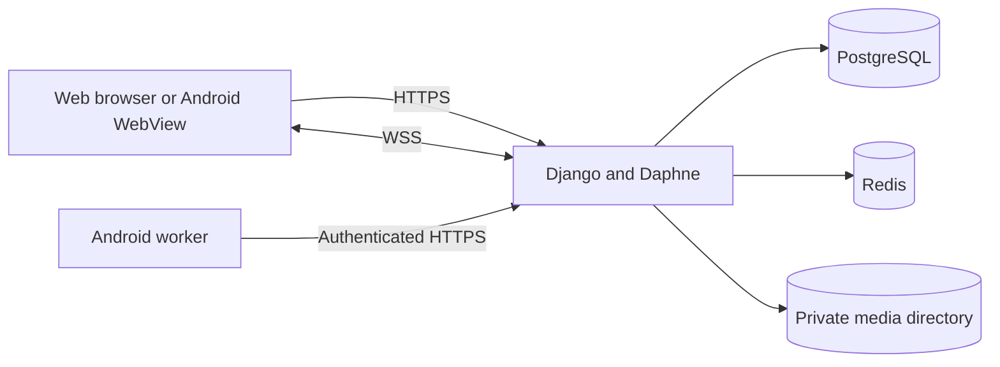

# Learning guide: how Pulse works

This guide follows a message from the user's screen to durable storage and back to another device. It is intended for contributors who know basic web development but are new to this project. For exact commands, see [deployment](DEPLOYMENT.md), [Android](ANDROID.md), and [testing](TESTING.md).

## 1. Start with the pieces

Pulse has one Django application and one Android wrapper. Django renders the responsive web UI and owns authentication, messages, uploads, profiles, and permissions. Daphne runs the ASGI application so ordinary HTTP and authenticated WebSockets share the same server. Redis distributes WebSocket events between server processes. PostgreSQL stores messages, users, and file paths. File bytes live in private media storage, outside PostgreSQL. The Android app displays the same web UI in a restricted WebView and adds Android permissions, downloads, and notification scheduling.

For local development, SQLite and an in-process channel layer replace PostgreSQL and Redis. Production should use PostgreSQL, Redis, and a persistent media mount.

## 2. Follow one message

The conversation page receives a page of recent messages. JavaScript groups their timestamps into local calendar days and renders text as text nodes, so message content is not HTML. A new message is sent with an HTTP POST containing a CSRF token and a client-generated UUID. The server checks that the sender belongs to the conversation, validates any attachment, saves the message, and responds with the saved record. It then broadcasts an event. The receiving screen gets that event over a WebSocket; if the connection was interrupted, it fetches missing history when it reconnects and also polls while visible.

The UUID makes retries safe. The integer message ID is useful for ordering and cursors, but public conversation and profile URLs use random UUIDs. Neither identifier replaces the membership check. A reply stores a reference only after the server confirms that the target message belongs to the same conversation.

Read receipts are cursor-based: a visible conversation near its newest message acknowledges messages received by that user up to a specified ID. Text drafts remain in the browser tab's session storage; files and recordings are not persisted as drafts.

## 3. Understand presence and the inbox

Each authenticated page connects to `/ws/inbox/` and sends a periodic heartbeat. It also posts a CSRF-protected HTTP heartbeat, which keeps presence current when a proxy drops WebSockets. A profile is considered online for 75 seconds after its latest heartbeat. Once the browser is suspended or closed, heartbeats stop and the last-seen timestamp remains available. This is an estimate of recent activity, not proof that somebody is looking at a conversation.

Inbox events trigger an immediate conversation-list refresh. A periodic HTTP refresh recovers events lost during a connection interruption. The Android WebView forwards notification checks to the native layer while it is open.

## 4. Understand Android notifications

The Android app uses the existing Django session to call `/api/mobile/unread/`. While the app is open it checks on inbox events and with a short fallback interval. WorkManager also schedules background checks, with a minimum periodic interval of 15 minutes. Android can delay those jobs for battery management. The native notification handler remembers the latest received message ID per account and avoids repeating alerts.

This is **periodic delivery**, not instant push. Closing the app does not disable scheduled work, but it does not guarantee an immediate alert either. Reliable immediate background delivery requires a push provider such as Firebase Cloud Messaging, device token registration, and a server-side sender. See [Android architecture and limitations](ANDROID.md).

## 5. Understand private files and profiles

An attachment's bytes are stored below `/app/media` in the container. The database stores its relative path. Django checks conversation membership before serving it. Profile photos are stored in the same media tree under `avatars/`; uploaded photos take priority over an optional Gravatar fallback. The admin file preview has its own permission check. Static CSS, JavaScript, and the site icon are different: they are public build assets served by WhiteNoise.

In production, `/app/media` must be mounted to durable host storage. The supplied [production Compose example](../compose.production.yml) maps it to `/srv/chatapp/media`. A Docker network only connects containers; it does not share files. If an existing File Browser container needs to inspect the same files, mount `/srv/chatapp/media` into that container separately, preferably read-only. Do not expose the private media directory as a public HTTP directory. See [storage migration and backups](STORAGE.md).

## 6. Make a safe change

Start with the server test suite, then browser tests for visible behavior. For Android changes, build both debug and release APKs in CI, verify their signatures, and install the release APK in an emulator. A phone test remains important for microphone access, battery restrictions, and manufacturer-specific behavior. Increment Android `versionCode` for every update and keep the permanent signing key: a package can update in place only when its signing certificate is unchanged.

Read [ARCHITECTURE.md](ARCHITECTURE.md) for endpoint and model details, [TESTING.md](TESTING.md) for commands, and [CONTRIBUTING.md](../CONTRIBUTING.md) before opening a pull request.
